# vue3-deno-blog-system

<p align=center>
  <a href="http://aurora20.nbsps.top:16666">
    
  </a>
</p>

<h2 align=center>
   献给樱岛麻衣 | 基于 vue3 + deno 开发 | 前后端分离个人博客系统
</h2>
<p align="center">
   <a target="_blank" href="https://github.com/nbsps/vue3-naiveui-deno-blog-system">
      
      
      
      
      
      
   </a>
</p>


<p align="center"> 
    <a href="#Abstract" style="text-decoration: none;">Abstract</a> | 
   <a href="#Project build" style="text-decoration: none;">Project build</a> | 
   <a href="#Preview" style="text-decoration: none;">Preview</a> | 
   <a href="#TODO" style="text-decoration: none;">TODO</a>
</p>

## Abstract

**献给樱桃麻衣~**

心血来潮花大半个月写的博客系统(样式借鉴了几个著名的主题)，还有很多想弄的功能没弄。

**前端**: **vue3**+vue-router+vuex+**naiveui**+less+tailwind+**···**

**后端**: **deno**+**oak**+mysql+**···**

## Project build

### 本地

```
环境：npm deno mysql
1. ./server    # 后端目录
   ./server/docker-entrypoint-initdb.d/blog.sql # 启动mysql服务并导入数据库
   # 启动后端服务
   deno run --unstable --allow-net --allow-write --allow-read --allow-env server.ts
2. ./          # 前端目录
   npm install # 安装依赖
   npm run serve # 启动服务
   npm run prettier # 如果有eslint:prettier报错
3. 访问127.0.0.1:8080
```

### VM

```
1. wget https://raw.githubusercontent.com/nbsps/vue3-naiveui-deno-blog-system/master/blog.sys.gz
2. tar -zxf blog.sys.gz
3. cd ./server
4. docker-compose up -d(如果有报错，建议docker-compose up查看报错，修改后docker-compose up --build)
5. 访问http://[your-vps]:16666
```

```
6. /login (Silvensn/123456)
```

## Preview

### 首页

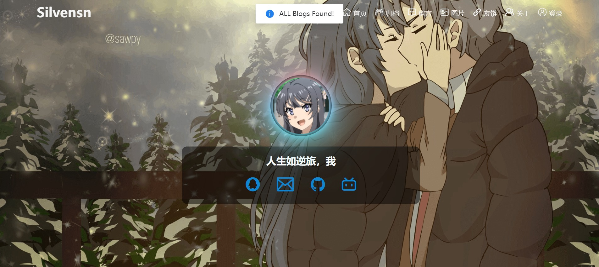

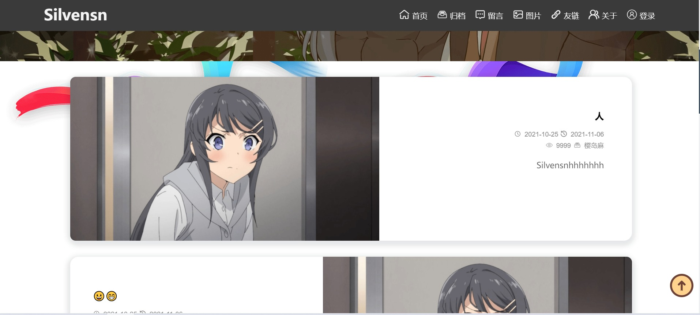

### 时间线

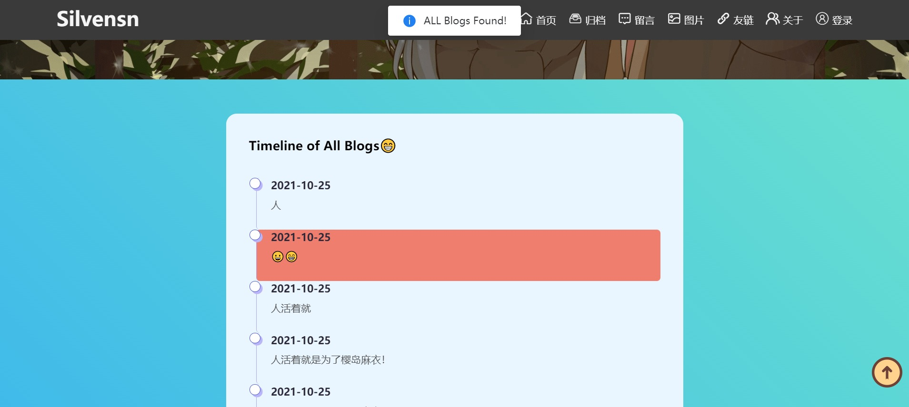

### 留言

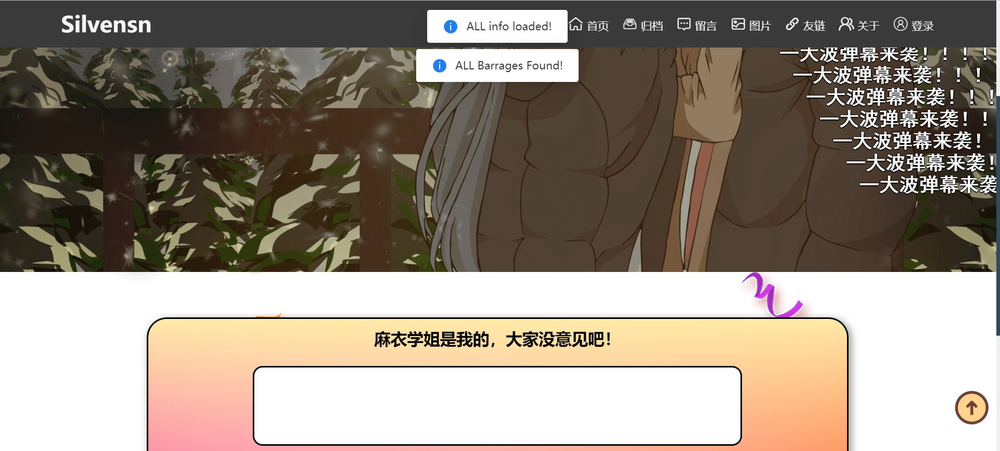

### 图片墙


### 友链

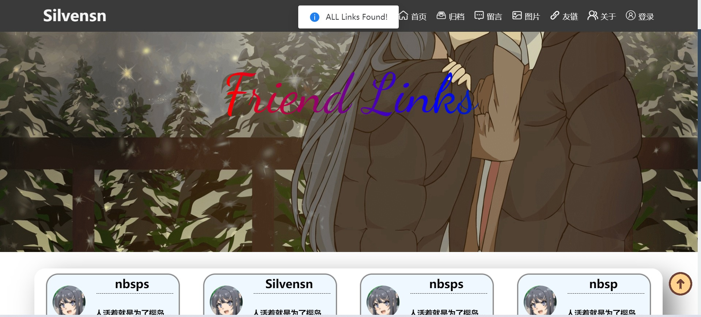

### 关于

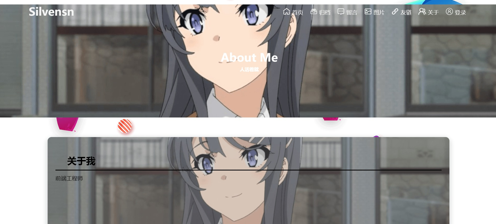

### 登录

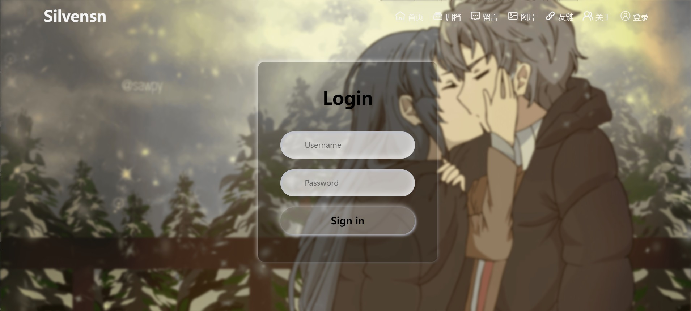

### 博客详情

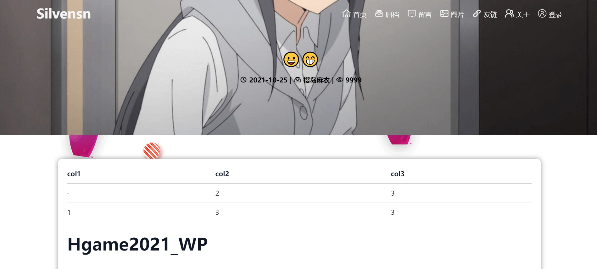

### 后台

#### 基础信息


#### 博客管理

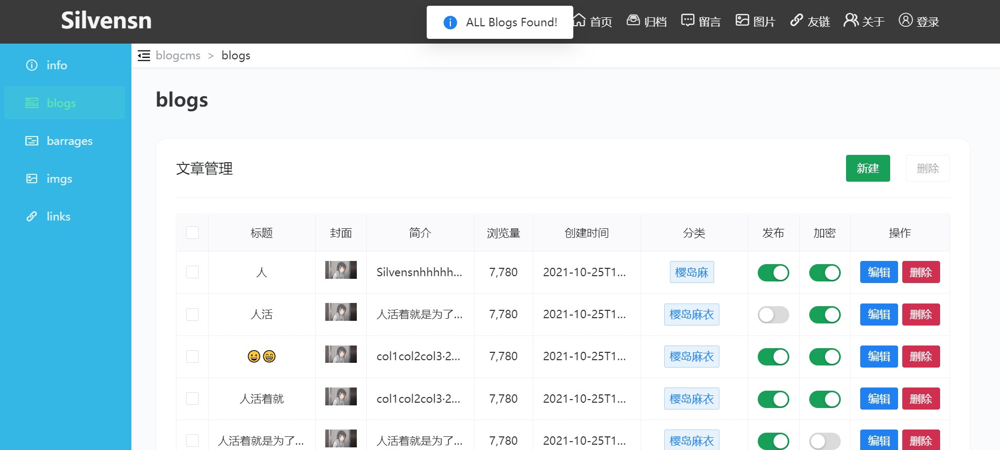

#### 弹幕管理

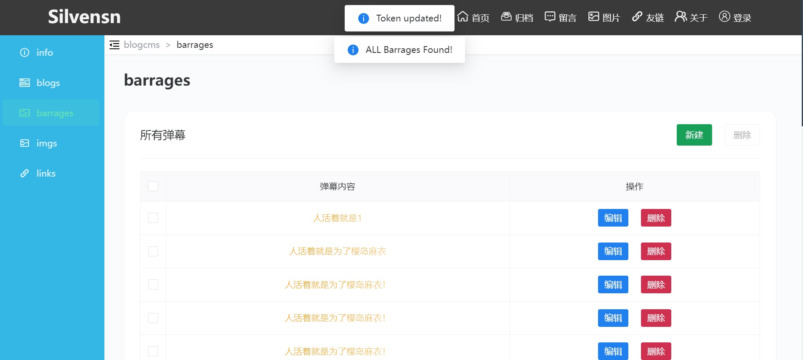

#### 图片墙管理

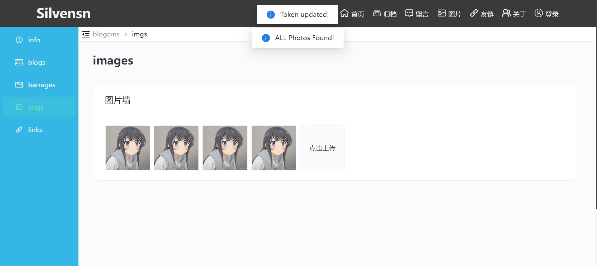

#### 友链管理

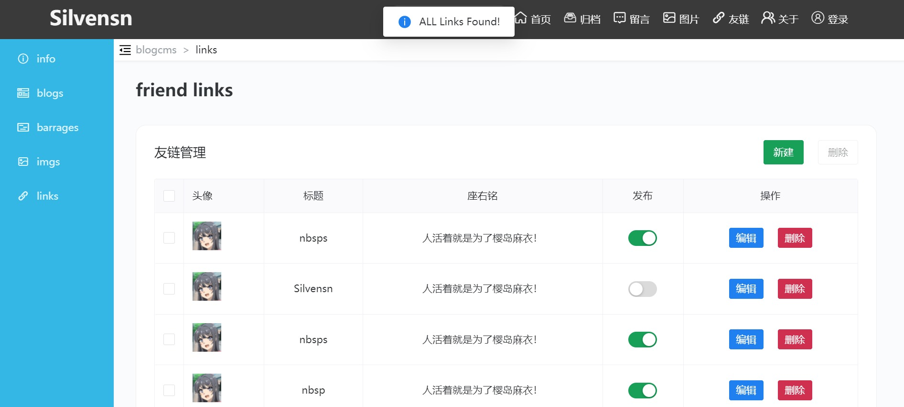

#### 编辑博客

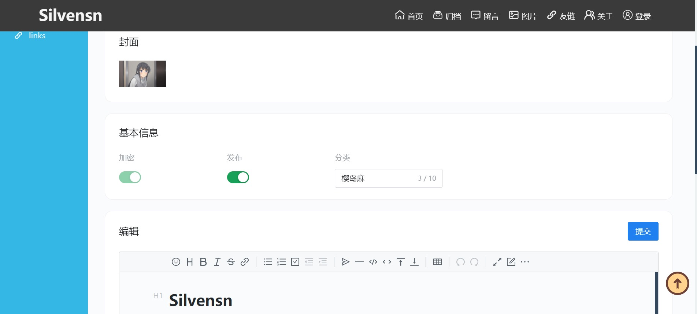

### 移动端


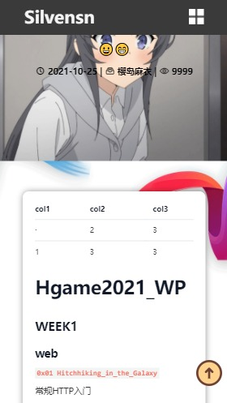

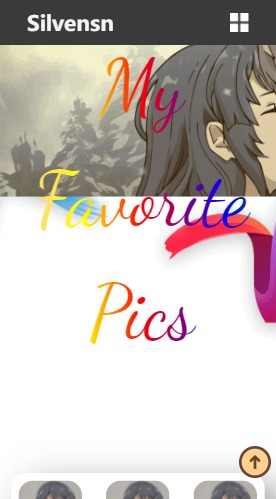

## TODO

- [ ] seo 优化？(slug?)

- [ ] tsx/jsx 重构？

- [ ] nodejs/ssm 后台？

- [ ] 进一步封装优化？

Welcome to fork and pull request.
